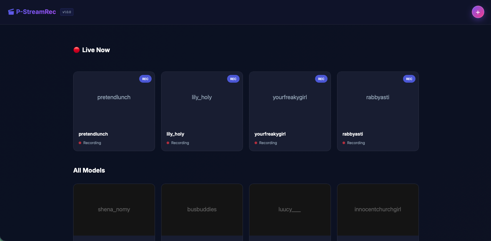

# P-StreamRec

[](LICENSE)
[](https://www.docker.com/)
[](https://github.com/raccommode/P-StreamRec)

**Automatic recording of Chaturbate and m3u8 streams with a modern web interface**



## ✨ Features

- 🎥 **24/7 automatic recording** - Monitors and records when users go live
- 🌐 **Web interface** - Manage recordings and watch replays in browser
- 📦 **Docker ready** - One command to get started
- 🔄 **GitOps updates** - Update directly from the interface
- 🎯 **Chaturbate + m3u8 support** - Works with any HLS stream
- 💾 **Smart storage** - Daily TS files, server-side persistence

## ⚙️ Configuration (Environment Variables)

| Variable | Default | Description |
|----------|---------|-------------|
| `OUTPUT_DIR` | `/data` | Recordings folder (Docker volume) |
| `PORT` | `8080` | Web interface port |
| `FFMPEG_PATH` | `ffmpeg` | Path to ffmpeg |
| `HLS_TIME` | `4` | HLS segment duration (seconds) |
| `HLS_LIST_SIZE` | `6` | Number of segments in playlist |
| `CB_RESOLVER_ENABLED` | `true` | **Enable Chaturbate support** |
| `CB_COOKIE` | - | Chaturbate session cookie (optional) |
| `AUTO_RECORD_USERS` | - | Comma-separated list of users to auto-record |
| `TZ` | `UTC` | Timezone (e.g., `America/New_York`) |

## 🚀 Quick Start

### Docker Run
```bash
docker run -d \
  --name p-streamrec \
  -p 8080:8080 \
  -v ./data:/data \
  -e CB_RESOLVER_ENABLED=true \
  ghcr.io/raccommode/p-streamrec:latest
```

### Docker Compose
```yaml
version: "3.8"
services:
  p-streamrec:
    image: ghcr.io/raccommode/p-streamrec:latest
    ports:
      - "8080:8080"
    volumes:
      - ./data:/data
    environment:
      - CB_RESOLVER_ENABLED=true
    restart: unless-stopped
```

### Portainer
1. Go to **Stacks** → **Add stack** → **Git Repository**
2. URL: `https://github.com/raccommode/P-StreamRec` | Branch: `main`
3. Deploy

**Access:** `http://localhost:8080`

## 📖 Usage

1. **Add a model**: Click **+** → Enter Chaturbate username or m3u8 URL
2. **Auto-record**: System checks every 2 minutes and records when live
3. **Watch replays**: Click model card → **Replays** tab
4. **Update**: Click **GitOps** button in header to update app (Git deployment only)

**Recordings:** `/data/records/<username>/YYYY-MM-DD.ts` (MPEG-TS format)

## 💻 Development

```bash
python -m venv .venv && source .venv/bin/activate
pip install -r requirements.txt
uvicorn app.main:app --reload
```

## 📂 File Management

**Play recordings:**
- VLC/MPV: Open `.ts` files directly
- Browser: Use Replays tab in web interface

**Convert to MP4:**
```bash
ffmpeg -i input.ts -c copy output.mp4
```

## ⚠️ Notes

- Storage: ~2-4 GB/hour per stream
- Use only for public, legally accessible content

## 📜 License

**Non-Commercial Open Source License** - See [LICENSE](LICENSE)

✅ Free to use, modify, and distribute  
❌ **No commercial use or revenue generation**  
🔄 Share modifications under same license  
📝 Attribution required
